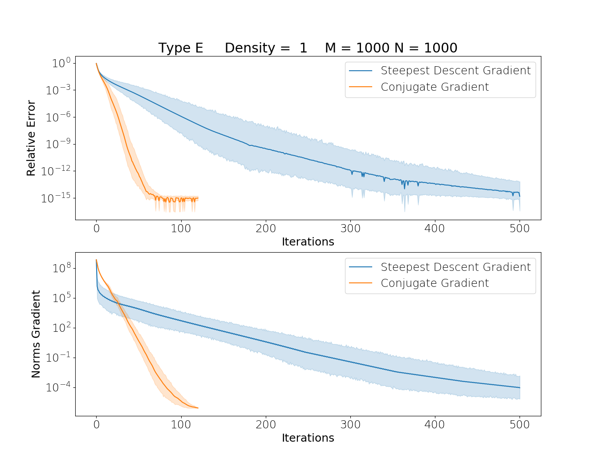

# CMProject
Project for the "computational mathematics" course fot the master in computer science.
In this project we implemented the 2-norm matrix calculus as an uncostrained optimization problem with the "Conjugate Gradient" and "Steppeste Descent Direction" algorithms.
All the math we have used is explained in the <a href = "/Report.pdf">report</a>.
## Getting started

Let's first take a look at the project organization and its requirements.

### Structure
The project is structured in the following way:
* MATLABsrc = scripts to create random matrix of different type
* Matrices =  folder containing the matrices created with matlab's scripts. There are 50 matrices, 10 for each type 
* Plot = folder containing the plots generated from the python's script 
* pythonsrc = contain a folder with the result in CSV format and the python script of tests and computing

### Prerequisites
The entire project was made with two language: python e matlab. 

The last one is not mandatory, indeed, in the appropriate folder there are already present a discrete number of matrices. It will instead be mandatory if there is a need to create new matrices.

As regard the first one, python, is used in its version 3.6. For a correct execution the following libraries will be needed:

* numpy
* scipy
* matplotlib
* seaborn
* pandas

## Running the tests

Before seeing what kind of tests we can do, let's see which other component we can found in the folders.

### Scripts
In the folder we can find the following scripts:
* pythonsrc/conf = a module that contains the parameters that the algorithms will need to work
* pythonsrc/normFunction = the script that implements the norm function
* pythonsrc/conjugateGradient = it implements the optimization of a function with the conjugte gradient method
* pythonsrc/steepestGradientDescent = it implements the optimization of a function with the steepest descent gradient method. 
* pythonsrc/utility = a script containing all support functions
* MATLABsrc/golub = a support script to generate an ill conditioned matrix

### Tests
We can find different type of tests to be launched. 
First of all, if we can generate a new block of 10 matrices we have to launch the matlab script in the matlab console specifying which we want. For example:

```
CreateMatrices('A')
CreateMatrices('B')
.
.
```

To generate a table, containing information about time and error values, for each type of matrix we need to launch the script:
```
mainTimeEstimation.py
```
This will produce a CSV file with the table and it will print the average time of execution for both algorithms.

To try a single algoritm we can launch:
```
mainCG.py or mainSGD.py
```

To plot the trend of both algorithms together and compare them, we can launch:
```
mainTest.py
```

that will generates a comparative image for each type of matrix. We can also print information about iterations and the value of gradient for each of them. To do it we can change:
```
30 optimizerSGD = SGD.steepestGradientDescent(f, initial_vector, False)
31 optimizerCG = CG.conjugateGradient(f, initial_vector, False)
   to
30 optimizerSGD = SGD.steepestGradientDescent(f, initial_vector, True)
31 optimizerCG = CG.conjugateGradient(f, initial_vector, True)         
```

At least, we can choose how many matrices (and how many type) we can read and consequently also how many functions we want to evaluate in the same plot trough:
```
9  numberOfMatrix = 10
10 typeMatrix = ['A', 'B', 'C', 'D', 'E']
```

### Results
We can see now some plot of the accuracy compared with the numpy.linalg.norm() function.
<div>
  
   
 </div>

